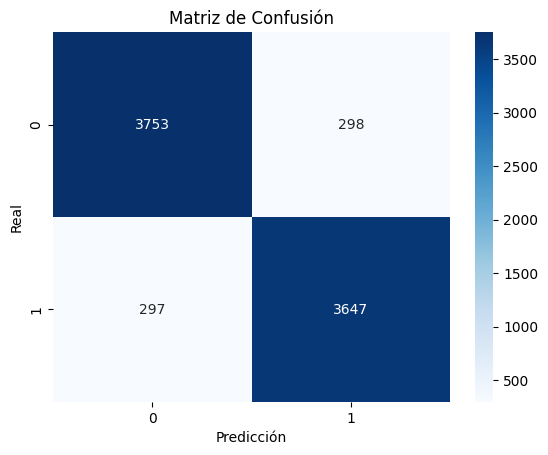

# Identificador de Imágenes: IA v/s Ser Humano

## Descripción del Problema
Con el rápido avance de las herramientas generativas, cada vez es más difícil distinguir visualmente entre fotografías reales y contenido creado artificialmente. El objetivo de este proyecto es resolver esta problemática mediante un modelo de Deep Learning capaz de facilitar la diferenciación de imágenes creadas por IA y por humanos de forma fácil, rápida y automatizada.

## Dataset: Descripción y Fuente
Para entrenar y evaluar el modelo, se utilizó el **"AI vs Human Generated Dataset"**, el cual contiene un gran volumen de imágenes etiquetadas como reales (humanas) y generadas por Inteligencia Artificial.
* **Fuente:** Kaggle
* * **Enlace:** [AI vs Human Generated Dataset - por alessandrasala79](https://www.kaggle.com/datasets/alessandrasala79/ai-vs-human-generated-dataset)

## Modelos Seleccionados y Justificación
Se seleccionó el modelo pre-entrenado **ResNet50** (implementado a través de la librería PyTorch) para la tarea de clasificación de imágenes.
* **Pertinencia:** ResNet50 es una Red Neuronal Convolucional (CNN) profunda que destaca en tareas de visión computacional.
* **Ventajas:** Gracias a su arquitectura de bloques residuales, soluciona el problema del desvanecimiento del gradiente, permitiendo entrenar redes muy profundas. Además, al usar *Transfer Learning* (modelo pre-entrenado), el modelo ya es capaz de reconocer patrones, texturas y bordes complejos, lo cual es ideal para detectar los sutiles "artefactos" visuales que suelen dejar los generadores de IA.
* **Limitaciones:** Al ser un modelo robusto, requiere de mayor capacidad computacional (uso de GPU) para su entrenamiento y ajuste (Fine-Tuning) en comparación con redes más superficiales.

## Metodología Aplicada y Justificación
1. **Análisis Exploratorio de Datos (EDA) y Feature Engineering:** Se cargaron las imágenes del dataset y se revisó la distribución de clases para asegurar el balance. Como parte del procesamiento, las imágenes fueron redimensionadas a 224x224 píxeles para ser compatibles con la entrada requerida por ResNet50, y se aplicó normalización utilizando los promedios y desviaciones estándar de ImageNet (es decir, *Data Augmentation* con rotaciones).
2. **Entrenamiento (Optimización):** Se adaptó la capa final de clasificación del modelo ResNet50 para entregar una salida binaria (IA vs. Humano). El modelo fue entrenado utilizando el optimizador Adam y una función de pérdida de entropía cruzada.
3. **Control de overfitting (Regularización):** Para evitar que el modelo se sobreajustara a los datos de entrenamiento, se implementaron técnicas de regularización como *Dropout* y *Weight-Decay*. 
4. **Testeo:** El modelo fue evaluado utilizando un conjunto de prueba (Test Set) completamente no visto por la red, compuesto por 7,995 imágenes.

## Resultados Obtenidos y Observaciones
El modelo demostró un rendimiento sobresaliente en la tarea de clasificación, logrando una **exactitud (Accuracy) del 93%** sobre el conjunto de prueba. 

**Reporte de Clasificación:**
* **Clase 0:** Precisión de 0.94 y Recall de 0.90 (F1-Score: 0.92)
* **Clase 1:** Precisión de 0.91 y Recall de 0.95 (F1-Score: 0.93)

**Análisis de la Matriz de Confusión:** Al observar la matriz de confusión, el modelo es altamente efectivo. De las 7,995 imágenes evaluadas:
* Logró predecir correctamente **3,605** imágenes de la Clase 0 y **3,791** de la Clase 1 (Verdaderos Positivos y Verdaderos Negativos).
* Los errores fueron mínimos: solo **385** Falsos Positivos y **214** Falsos Negativos.

**Discusión crítica:** Las métricas indican un modelo equilibrado. Existe una leve inclinación hacia un *Recall* más alto en la Clase 1 (0.95) en comparación con la Clase 0 (0.90). Esto significa que el modelo es excepcionalmente bueno detectando las imágenes de la Clase 1 (minimizando los falsos negativos de esta clase a solo 214), aunque sacrifica un pequeño margen de precisión al clasificar erróneamente 385 imágenes de la Clase 0 como Clase 1. En un contexto de detección de IA, esta sensibilidad suele ser deseable.

## Conclusiones
Los resultados respaldan firmemente la eficacia de utilizar arquitecturas profundas pre-entrenadas como ResNet50 para la detección de imágenes generadas por IA. El alto nivel de exactitud (93%) y el F1-Score general demuestran que la metodología de *Transfer Learning*, sumada a un correcto preprocesamiento de imágenes y técnicas de regularización, es una solución robusta y rápida para diferenciar contenido artificial del real en entornos prácticos.
